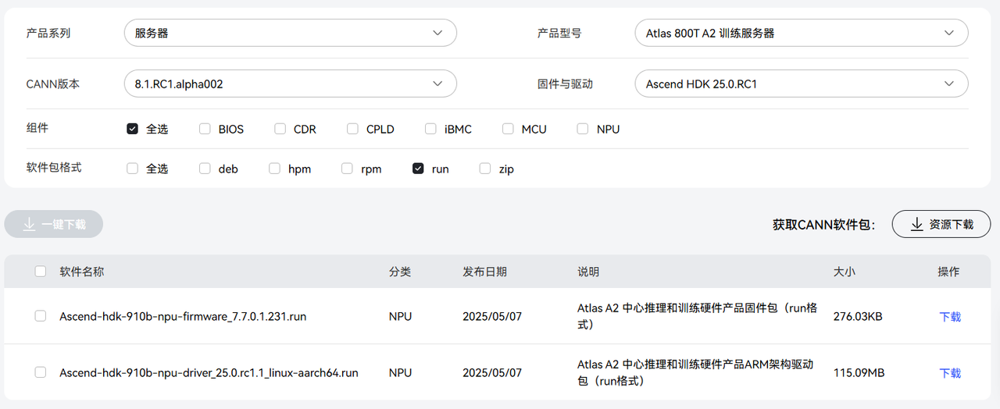
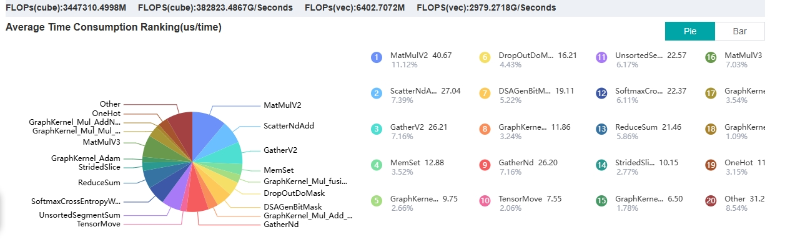

# Table of Contents
- [1. Environment Requirements](#1-environment-requirements)
- [2. Environment Setup](#2-environment-setup)
  - [2.1 Download](#21-download)
  - [2.2 Installation](#22-installation)
- [3. Operator Deployment](#3-operator-deployment)
- [4. Project Start](#4-project-start)
- [5. Acknowledgments](#5-acknowledgments)

---

# 1. Environment Requirements
| Software/Hardware | Version/Model |
|-------------------|---------------|
| **Server**        | Atlas 800T A2 Training Server<br>NPU Model: Ascend910B3<br>CPU Architecture: AArch64 |
| **Firmware**      | Ascend HDK 25.0.RC1<br>Package Name: Ascend-hdk-910b-npu-firmware_7.7.0.1.231.run |
| **Driver**        | Ascend HDK 25.0.RC1<br>Package Name: Ascend-hdk-910b-npu-driver_25.0.rc1.1_linux-aarch64.run |
| **MindSpore**     | 2.3.1 |
| **MindSpore_GL**  | 0.2 |
| **MindInsight**   | 2.3.1 |

---

# 2. Environment Setup

## 2.1 Download

### 2.1.1 [Firmware and Driver](https://www.hiascend.com/hardware/firmware-drivers/community?product=4&model=26&cann=8.1.RC1.alpha002&driver=Ascend+HDK+25.0.RC1)


### 2.1.2 [CANN](https://www.hiascend.com/developer/download/community/result?module=cann&cann=8.1.RC1.alpha002)


---

## 2.2 Installation

### 2.2.1 Firmware and Driver
Reference Link: [Install NPU Driver Firmware](https://support.huawei.com/enterprise/zh/doc/EDOC1100349380/ac9d2505)

1. **Log in to the server as `root` user.**
2. **Create a driver runtime user `HwHiAiUser` (user for running driver processes).**
   ```bash
   groupadd HwHiAiUser
   useradd -g HwHiAiUser -d /home/HwHiAiUser -m HwHiAiUser -s /bin/bash
   ```
3. **Upload the driver and firmware packages to any directory on the server, e.g., `/home`.**
4. **Add executable permissions to the driver and firmware packages.**
   ```bash
   chmod +x Ascend-hdk-910b-npu-driver_25.0.rc1.1_linux-aarch64.run
   chmod +x Ascend-hdk-910b-npu-firmware_7.7.0.1.231.run
   ```
5. **Install the driver and firmware.**
   - **Install the driver**
     ```bash
     ./Ascend-hdk-910b-npu-driver_25.0.rc1.1_linux-aarch64.run --full --install-for-all
     ```
     > If missing tools error occurs:
     > ```
     > [ERROR]The list of missing tools: lspci,ifconfig,
     > ```
     > Refer to [Driver Installation Missing Dependency Error](https://support.huawei.com/enterprise/zh/doc/EDOC1100349380/3652fc47#ZH-CN_TOPIC_0000001782749677).

     > If DKMS compilation fails:
     > ```
     > [ERROR]Dkms install failed, details in : var/log/ascend_seclog/ascend_install.log.
     > ```
     > Refer to [DKMS Compilation Failure During Driver Installation](https://support.huawei.com/enterprise/zh/doc/EDOC1100349380/64a31720#ZH-CN_TOPIC_0000001784970501).

     > Successful installation message:
     > ```
     > Driver package installed successfully!
     > ```

   - **Install the firmware**
     ```bash
     ./Ascend-hdk-910b-npu-firmware_7.7.0.1.231.run --full
     ```
     > Successful installation message:
     > ```
     > Firmware package installed successfully! Reboot now or after driver installation for the installation/upgrade to take effect.
     > ```
6. **Restart the system (optional).**
   ```bash
   reboot
   ```
7. **Verify driver loading.**
   ```bash
   npu-smi info
   ```
   > **Note: Non-root users need to add HwHiAiUser.**
   > ```bash
   > sudo usermod -aG HwHiAiUser username
   > ```

---

### 2.2.2 CANN
Reference Link: [Install CANN](https://zhuanlan.zhihu.com/p/719099792)

1. **Switch to root user.**
   ```bash
   sudo su
   ```
2. **Modify CANN package permissions.**
   ```bash
   chmod +x Ascend-cann-kernels-910b_8.1.RC1.alpha002_linux-aarch64.run
   chmod +x Ascend-cann-toolkit_8.1.RC1.alpha002_linux-aarch64.run
   ```
3. **Install CANN.**
   - Remove old versions (if needed):
     ```bash
     rm -rf /usr/local/Ascend/ascend-toolkit
     ```
   - Install the toolkit:
     ```bash
     ./Ascend-cann-toolkit_8.1.RC1.alpha002_linux-aarch64.run --install
     ```
   - Install the kernel package:
     ```bash
     ./Ascend-cann-kernels-910b_8.1.RC1.alpha002_linux-aarch64.run
     ```
4. **Verify installation.**
   ```bash
   ls /usr/local/Ascend/ascend-toolkit/latest/opp/built-in/op_impl/ai_core/tbe/kernel/
   ```
5. **Configure environment variables.**
   ```bash
   vim ~/.bashrc
   # Add the following:
   source /usr/local/Ascend/ascend-toolkit/set_env.sh
   ```

---

### 2.2.3 MindSpore
Reference Link: [Install MindSpore](https://zhuanlan.zhihu.com/p/719099792)

1. **Create a Python environment.**
   ```bash
   conda create -n mindspore python=3.9
   conda activate mindspore
   ```
2. **Install dependencies.**
   ```bash
   pip install sympy
   pip install numpy==1.26
   pip install /usr/local/Ascend/ascend-toolkit/latest/lib64/te-*-py3-none-any.whl
   pip install /usr/local/Ascend/ascend-toolkit/latest/lib64/hccl-*-py3-none-any.whl
   ```
3. **Install MindSpore and MindInsight.**
   ```bash
   pip install mindspore==2.3.1
   pip install mindinsight==2.3.1
   ```
4. **Verify installation.**
   ```bash
   python -c "import mindspore;mindspore.set_context(device_target='Ascend');mindspore.run_check()"
   ```
   > Successful installation message:
   > ```
   > The result of multiplication calculation is correct, MindSpore has been installed on platform [Ascend] successfully!
   > ```

---

### 2.2.4 MindSpore_GL
Reference Link: [MindSpore Graph Learning](https://gitee.com/mindspore/graphlearning)

1. **Download the source code.**
   ```bash
   git clone https://gitee.com/mindspore/graphlearning.git
   ```
2. **Compile and install.**
   ```bash
   cd graphlearning
   bash build.sh
   pip install ./output/mindspore_gl*.whl
   ```
3. **Verify installation.**
   ```bash
   python -c 'import mindspore_gl'
   ```
   > If no error "No module named 'mindspore_gl'" occurs, the installation is successful.

---

# 3. Operator Deployment

1. **Compile the operator project.**
   ```bash
   sudo su root
   conda activate mindspore
   cd MmadCustom
   ./build.sh
   ```
2. **Declare environment variables.**
   ```bash
   vim ~/.bashrc
   export ASCEND_CUSTOM_OPP_PATH={build_out_path}build_out/_CPack_Packages/Linux/External/custom_opp_openEuler_aarch64.run/packages/vendors/customize:$ASCEND_CUSTOM_OPP_PATH
   source ~/.bashrc
   ```
3. **Test normal invocation.**
   ```bash
   python ../test/test_mmad.py
   ```

---

# 4. Project Start

## 4.1. NeutronAscend
1. **Data Preprocessing.**
   ```bash
   cd ./data_preprocessing
   python preprocess.py --dataset_name=Cora
   ```
2. **Start Training.**
   ```bash
   cd ..
   python main.py --data-name=Cora --epochs=20 --num-layers=2 --num-hidden=256 --aicore-num=20 
   ```
## 4.2 Baseline

### 4.2.1 MindsporeGL-graph
   **Start Training.**
   ```bash
   cd ./baseline/graphlearning/examples
   python vc_gcn_datanet.py   --data-name=Cora --epochs=20 --num-layers=2 --num-hidden=256 --fuse
   ```
### 4.2.2 MindsporeGL-pynative
   **Start Training.**
   ```bash
   cd ./baseline/graphlearning/examples
   python vc_gcn_datanet.py   --data-name=Cora --epochs=20 --num-layers=2 --num-hidden=256  
   ```
### 4.2.3 graphlearning_TP

1. **Compile Operator Project.**
   ```bash
   cd ./baseline/graphlearning_TP/MmadCustomTP
   ./build.sh
   ```
2. **Declare Environment Variables.**
   ```bash
   vim ~/.bashrc
   export ASCEND_CUSTOM_OPP_PATH={build_out_path}build_out/_CPack_Packages/Linux/External/custom_opp_openEuler_aarch64.run/packages/vendors/customize:$ASCEND_CUSTOM_OPP_PATH
   source ~/.bashrc
   ```
3. **Data Preprocessing.**
   ```bash
   cd ../../../data_preprocessing
   python preprocess.py --dataset_name=Cora
   ```
4. **Start Training.**
   ```bash
   cd ../baseline/graphlearning_TP/examples
   python vc_gcn_datanet.py  --data-name=Cora --epochs=10 --num-layers=2 --num-hidden=256 
   ```

## 4.3 Performance Comparison Experiments (MindsporeGL-pynative VS NeutronAscend)

1. **Hidden Layer Dimensions**

```
python vc_gcn_datanet.py --data-name=Cora --epochs=10 --num-layers=2 --num-hidden=256
python main.py --data-name=Cora --epochs=10 --num-layers=2 --num-hidden=256
```

| MindsporeGL-pynative | NeutronAscend |
|----------------------|---------------|
| train_loss=1.9464992<br>Epoch time:6721.97151184082 ms Train loss 1.9464992 Test acc:0.231 | train_loss=1.9460183<br>Epoch time:8017.242193222046 ms Train loss 1.9460183 Test acc:0.24 |
| train_loss=1.9031433<br>Epoch time:20.583629608154297 ms Train loss 1.9031433 Test acc:0.31 | train_loss=1.9028889<br>Epoch time:5.220174789428711 ms Train loss 1.9028889 Test acc:0.268 |
| train_loss=1.862346<br>Epoch time:12.070894241333008 ms Train loss 1.862346 Test acc:0.374 | train_loss=1.8609746<br>Epoch time:4.431247711181641 ms Train loss 1.8609746 Test acc:0.323 |
| train_loss=1.8172696<br>Epoch time:12.262344360351562 ms Train loss 1.8172696 Test acc:0.471 | train_loss=1.8123358<br>Epoch time:4.806756973266602 ms Train loss 1.8123358 Test acc:0.441 |
| train_loss=1.7612681<br>Epoch time:11.719465255737305 ms Train loss 1.7612681 Test acc:0.564 | train_loss=1.7598159<br>Epoch time:4.66609001159668 ms Train loss 1.7598159 Test acc:0.559 |
| train_loss=1.7140642<br>Epoch time:11.707544326782227 ms Train loss 1.7140642 Test acc:0.633 | train_loss=1.6903038<br>Epoch time:4.644870758056641 ms Train loss 1.6903038 Test acc:0.662 |
| train_loss=1.636764<br>Epoch time:11.937141418457031 ms Train loss 1.636764 Test acc:0.699 | train_loss=1.6496036<br>Epoch time:4.580974578857422 ms Train loss 1.6496036 Test acc:0.715 |
| train_loss=1.5727236<br>Epoch time:13.03243637084961 ms Train loss 1.5727236 Test acc:0.757 | train_loss=1.5559793<br>Epoch time:4.574775695800781 ms Train loss 1.5559793 Test acc:0.774 |
| train_loss=1.5089473<br>Epoch time:11.981725692749023 ms Train loss 1.5089473 Test acc:0.79 | train_loss=1.5101113<br>Epoch time:4.597187042236328 ms Train loss 1.5101113 Test acc:0.805 |
| train_loss=1.4413587<br>Epoch time:11.902093887329102 ms Train loss 1.4413587 Test acc:0.798 | train_loss=1.3996819<br>Epoch time:4.586458206176758 ms Train loss 1.3996819 Test acc:0.813 |
| Model:GCN Dataset:Cora Avg epoch time:12.077535901750837 | Model:GCN Dataset:Cora Avg epoch time:4.636730466570173 |

2. **Number of Layers**

   - **Three Layers**
   ```
   python vc_gcn_datanet.py --data-name=Cora --epochs=10 --num-layers=3 --num-hidden=256
   python main.py --data-name=Cora --epochs=10 --num-layers=3 --num-hidden=256
   ```
| MindsporeGL-pynative  | NeutronAscend |
|--------------------------------------------|-------------------------------------|
| Epoch time:6817.836046218872 ms Train loss 1.9462851 Test acc:0.315 | Epoch time:8793.636322021484 ms Train loss 1.9455684 Test acc:0.218 |
| train_loss=1.8981811<br>Epoch time:22.810935974121094 ms Train loss 1.8981811 Test acc:0.418 | train_loss=1.8954426<br>Epoch time:7.243633270263672 ms Train loss 1.8954426 Test acc:0.446 |
| train_loss=1.8318211<br>Epoch time:16.355276107788086 ms Train loss 1.8318211 Test acc:0.678 | train_loss=1.8298885<br>Epoch time:7.094144821166992 ms Train loss 1.8298885 Test acc:0.536 |
| train_loss=1.7208747<br>Epoch time:15.924453735351562 ms Train loss 1.7208747 Test acc:0.787 | train_loss=1.7077127<br>Epoch time:8.560895919799805 ms Train loss 1.7077127 Test acc:0.706 |
| train_loss=1.535662<br>Epoch time:16.00790023803711 ms Train loss 1.535662 Test acc:0.76 | train_loss=1.5458547<br>Epoch time:7.510900497436523 ms Train loss 1.5458547 Test acc:0.657 |
| train_loss=1.3136154<br>Epoch time:15.717267990112305 ms Train loss 1.3136154 Test acc:0.768 | train_loss=1.3178718<br>Epoch time:6.683349609375 ms Train loss 1.3178718 Test acc:0.793 |
| train_loss=1.0799528<br>Epoch time:15.77305793762207 ms Train loss 1.0799528 Test acc:0.807 | train_loss=1.0884048<br>Epoch time:6.659746170043945 ms Train loss 1.0884048 Test acc:0.805 |
| train_loss=0.80185837<br>Epoch time:15.743494033813477 ms Train loss 0.80185837 Test acc:0.797 | train_loss=0.84241307<br>Epoch time:6.627559661865234 ms Train loss 0.84241307 Test acc:0.751 |
| train_loss=0.61293924<br>Epoch time:15.693902969360352 ms Train loss 0.61293924 Test acc:0.783 | train_loss=0.6218153<br>Epoch time:6.43467903137207 ms Train loss 0.6218153 Test acc:0.757 |
| train_loss=0.45780012<br>Epoch time:15.574455261230469 ms Train loss 0.45780012 Test acc:0.802 | train_loss=0.44033584<br>Epoch time:6.44373893737793 ms Train loss 0.44033584 Test acc:0.802 |
| **Model:GCN Dataset:Cora Avg epoch time:15.7764 ms** | **Model:GCN Dataset:Cora Avg epoch time:6.9887 ms** |


---

3. **Memory and Power Consumption** (GPU data in `data_preprocessing/ntspowerdraw.py`)
   ```bash
   # Collect during training
   python vc_gcn_datanet.py   --data-name=Cora --epochs=100 --num-layers=2 --num-hidden=256
   stdbuf -oL npu-smi info watch -i {device-id} | tee train.log #device-id = npu_id
   ```

   ```
   NpuID(Idx)  ChipId(Idx) Pwr(W)      Temp(C)     AI Core(%)  AI Cpu(%)   Ctrl Cpu(%) Memory(%)   Memory BW(%)
   2           0           90.1        34          0           0           2           5           0           
   2           0           90.2        34          0           0           0           5           0           
   2           0           90.3        34          0           0           0           5           0           
   2           0           90.2        34          0           0           1           5           0           
   2           0           90.2        34          0           0           2           5           0           
   2           0           90.2        34          0           0           1           5           0           
   2           0           90.2        34          0           0           1           5           0           
   2           0           90.2        34          0           0           0           5           0           
   2           0           90.2        34          0           0           1           5           0           
   2           0           90.2        34          0           0           3           5           0           
   2           0           97.6        34          0           0           16          5           0           
   2           0           90.7        34          0           0           0           5           0           
   2           0           90.1        34          0           0           0           5           0           
   2           0           90.1        34          0           0           2           5           0           
   2           0           98.1        34          0           0           6           5           0           
   2           0           98.1        34          0           0           2           5           0           
   2           0           98.0        34          0           0           1           5           0           
   2           0           98.1        34          0           0           3           5           0           
   2           0           98.2        34          0           0           4           5           0           
   2           0           98.3        34          0           0           2           5           0           
   2           0           100.1       34          0           0           1           5           0           
   2           0           99.4        35          0           0           0           5           0           
   2           0           98.2        34          0           0           2           5           0           
   2           0           98.2        34          0           0           0           5           0           
   2           0           90.2        34          0           0           4           5           0           
   2           0           93.2        34          0           0           0           5           0           
   2           0           93.0        34          0           0           3           5           0           
   2           0           90.2        34          0           0           11          5           0           
   2           0           90.2        34          0           0           3           5           0           
   2           0           90.2        34          0           0           3           5           0           
   2           0           90.2        34          0           0           0           5           0           
   ```
4. **Operator Time Proportion**
   ```bash
   python vc_gcn_datanet.py   --data-name=Cora --epochs=100 --num-layers=2 --num-hidden=256 --fuse --profile # Add --profile parameter
   mindinsight start
   ## Open the prof folder in the browser to view
   ```
   

---

# 5. Acknowledgment

This project references the design and implementation of [MindSpore graphlearning](https://gitee.com/mindspore/graphlearning). Thanks for providing open-source code and documentation support.
