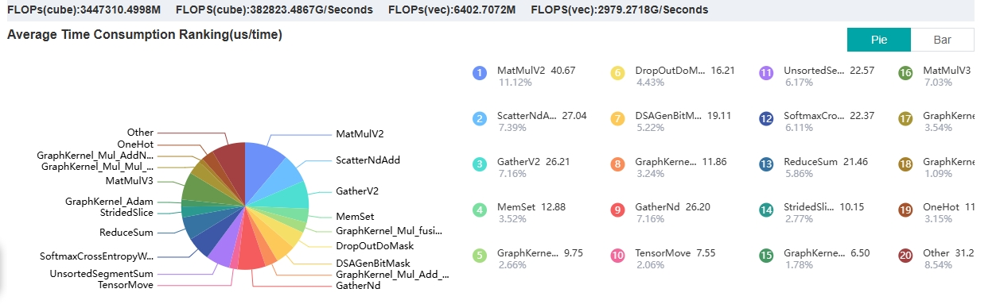

# 目录
- [1. 环境要求](#1-环境要求)
- [2. 配置环境](#2-配置环境)
  - [2.1 下载](#21-下载)
  - [2.2 安装](#22-安装)
- [3. 算子部署](#3-算子部署)
- [4. 项目开始](#4-项目开始)
- [5. 致谢](#5-致谢)

---

# 1. 环境要求
| 软件/硬件 | 版本/型号 |
|-----------|-----------|
| **服务器** | Atlas 800T A2 训练服务器<br>NPU型号: Ascend910B3<br>CPU架构: AArch64 |
| **固件**   | Ascend HDK 25.0.RC1<br>软件包名称：Ascend-hdk-910b-npu-firmware_7.7.0.1.231.run |
| **驱动**   | Ascend HDK 25.0.RC1<br>软件包名称：Ascend-hdk-910b-npu-driver_25.0.rc1.1_linux-aarch64.run |
| **MindSpore** | 2.3.1 |
| **MindSpore_GL** | 0.2 |
| **MindInsight** | 2.3.1 |
---

# 2. 配置环境

## 2.1 下载

### 2.1.1 [固件和驱动](https://www.hiascend.com/hardware/firmware-drivers/community?product=4&model=26&cann=8.1.RC1.alpha002&driver=Ascend+HDK+25.0.RC1)


### 2.1.2 [CANN](https://www.hiascend.com/developer/download/community/result?module=cann&cann=8.1.RC1.alpha002)


---

## 2.2 安装

### 2.2.1 固件和驱动
参考链接: [安装NPU驱动固件](https://support.huawei.com/enterprise/zh/doc/EDOC1100349380/ac9d2505)

1. **以`root`用户登录服务器。**
2. **创建驱动运行用户`HwHiAiUser`（运行驱动进程的用户）。**
   ```bash
   groupadd HwHiAiUser
   useradd -g HwHiAiUser -d /home/HwHiAiUser -m HwHiAiUser -s /bin/bash
   ```
3. **将驱动包和固件包上传到服务器任意目录如“/home”。**
4. **增加驱动和固件包的可执行权限。**
   ```bash
   chmod +x Ascend-hdk-910b-npu-driver_25.0.rc1.1_linux-aarch64.run
   chmod +x Ascend-hdk-910b-npu-firmware_7.7.0.1.231.run
   ```
5. **安装驱动和固件。**
   - **安装驱动**
     ```bash
     ./Ascend-hdk-910b-npu-driver_25.0.rc1.1_linux-aarch64.run --full --install-for-all
     ```
     > 如果出现缺少工具报错：
     > ```
     > [ERROR]The list of missing tools: lspci,ifconfig,
     > ```
     > 请参考[驱动安装缺少依赖报错](https://support.huawei.com/enterprise/zh/doc/EDOC1100349380/3652fc47#ZH-CN_TOPIC_0000001782749677)。

     > 如果出现DKMS编译失败：
     > ```
     > [ERROR]Dkms install failed, details in : var/log/ascend_seclog/ascend_install.log.
     > ```
     > 请参考[驱动安装过程中出现DKMS编译失败](https://support.huawei.com/enterprise/zh/doc/EDOC1100349380/64a31720#ZH-CN_TOPIC_0000001784970501)。

     > 安装成功提示：
     > ```
     > Driver package installed successfully!
     > ```

   - **安装固件**
     ```bash
     ./Ascend-hdk-910b-npu-firmware_7.7.0.1.231.run --full
     ```
     > 安装成功提示：
     > ```
     > Firmware package installed successfully! Reboot now or after driver installation for the installation/upgrade to take effect.
     > ```
6. **重启系统（可选）。**
   ```bash
   reboot
   ```
7. **验证驱动加载。**
   ```bash
   npu-smi info
   ```
   > **注意：非root用户需要添加HwHiAiUser。**
   > ```bash
   > sudo usermod -aG HwHiAiUser username
   > ```

---

### 2.2.2 CANN
参考链接: [安装CANN](https://zhuanlan.zhihu.com/p/719099792)

1. **进入root用户。**
   ```bash
   sudo su
   ```
2. **修改CANN包权限。**
   ```bash
   chmod +x Ascend-cann-kernels-910b_8.1.RC1.alpha002_linux-aarch64.run
   chmod +x Ascend-cann-toolkit_8.1.RC1.alpha002_linux-aarch64.run
   ```
3. **安装CANN。**
   - 删除旧版本（如果需要）：
     ```bash
     rm -rf /usr/local/Ascend/ascend-toolkit
     ```
   - 安装工具包：
     ```bash
     ./Ascend-cann-toolkit_8.1.RC1.alpha002_linux-aarch64.run --install
     ```
   - 安装内核包：
     ```bash
     ./Ascend-cann-kernels-910b_8.1.RC1.alpha002_linux-aarch64.run
     ```
4. **验证安装。**
   ```bash
   ls /usr/local/Ascend/ascend-toolkit/latest/opp/built-in/op_impl/ai_core/tbe/kernel/
   ```
5. **配置环境变量。**
   ```bash
   vim ~/.bashrc
   # 添加以下内容：
   source /usr/local/Ascend/ascend-toolkit/set_env.sh
   ```

---

### 2.2.3 MindSpore
参考链接: [安装MindSpore](https://zhuanlan.zhihu.com/p/719099792)

1. **创建Python环境。**
   ```bash
   conda create -n mindspore python=3.9
   conda activate mindspore
   ```
2. **安装依赖。**
   ```bash
   pip install sympy
   pip install numpy==1.26
   pip install /usr/local/Ascend/ascend-toolkit/latest/lib64/te-*-py3-none-any.whl
   pip install /usr/local/Ascend/ascend-toolkit/latest/lib64/hccl-*-py3-none-any.whl
   ```
3. **安装MindSpore和MindInsight。**
   ```bash
   pip install mindspore==2.3.1
   pip install mindinsight==2.3.1
   ```
4. **验证安装。**
   ```bash
   python -c "import mindspore;mindspore.set_context(device_target='Ascend');mindspore.run_check()"
   ```
   > 安装成功提示：
   > ```
   > The result of multiplication calculation is correct, MindSpore has been installed on platform [Ascend] successfully!
   > ```

---

### 2.2.4 MindSpore_GL
参考链接: [MindSpore Graph Learning](https://gitee.com/mindspore/graphlearning)

1. **下载源码。**
   ```bash
   git clone https://gitee.com/mindspore/graphlearning.git
   ```
2. **编译并安装。**
   ```bash
   cd graphlearning
   bash build.sh
   pip install ./output/mindspore_gl*.whl
   ```
3. **验证安装。**
   ```bash
   python -c 'import mindspore_gl'
   ```
   > 如果没有报错“No module named 'mindspore_gl'”，则说明安装成功。

---

# 3. 算子部署

1. **编译算子工程。**
   ```bash
   sudo su root
   conda activate mindspore
   cd MmadCustom
   ./build.sh
   ```
2. **声明环境变量。**
   ```bash
   vim ~/.bashrc
   export ASCEND_CUSTOM_OPP_PATH={build_out_path}build_out/_CPack_Packages/Linux/External/custom_opp_openEuler_aarch64.run/packages/vendors/customize:$ASCEND_CUSTOM_OPP_PATH
   source ~/.bashrc
   ```
3. **测试正常调用。**
   ```bash
   python ../test/test_mmad.py
   ```

---

# 4. 项目开始

## 4.1. NeutronAscend
1. **数据预处理。**
   ```bash
   cd ./data_preprocessing
   python preprocess.py --dataset_name=Cora
   ```
2. **开始训练。**
   ```bash
   cd ..
   python main.py --data-name=Cora --epochs=20 --num-layers=2 --num-hidden=256 --aicore-num=20 
   ```
## 4.2 baseline

### 4.2.1 MindsporeGL-graph
   **开始训练。**
   ```bash
   cd ./baseline/graphlearning/examples
   python vc_gcn_datanet.py   --data-name=Cora --epochs=20 --num-layers=2 --num-hidden=256 --fuse
   ```
### 4.2.2 MindsporeGL-pynative
   **开始训练。**
   ```bash
   cd ./baseline/graphlearning/examples
   python vc_gcn_datanet.py   --data-name=Cora --epochs=20 --num-layers=2 --num-hidden=256  
   ```
### 4.2.3 graphlearning_TP
   
1. **编译算子工程。**
   ```bash
   cd ./baseline/graphlearning_TP/MmadCustomTP
   ./build.sh
   ```
2. **声明环境变量。**
   ```bash
   vim ~/.bashrc
   export ASCEND_CUSTOM_OPP_PATH={build_out_path}build_out/_CPack_Packages/Linux/External/custom_opp_openEuler_aarch64.run/packages/vendors/customize:$ASCEND_CUSTOM_OPP_PATH
   source ~/.bashrc
3. **数据预处理。**
   ```bash
   cd ../../../data_preprocessing
   python preprocess.py --dataset_name=Cora
   ```
4. **开始训练。**
   ```bash
   cd ../baseline/graphlearning_TP/examples
   python vc_gcn_datanet.py  --data-name=Cora --epochs=10 --num-layers=2 --num-hidden=256 
   ```

## 4.3 性能对比实验(以MindsporeGL-pynative举例)
1. **层数**
   - **两层**
   ```
   python vc_gcn_datanet.py  --data-name=products --epochs=10 --num-layers=2 --num-hidden=256 
   ```
  
   ```
   dataset contains  2449029 nodes 61859140 edges
   train_loss=12.072141
   Epoch time:8450.45781135559 ms Train loss 12.072141 Test acc:0.34154537703149124
   train_loss=3.5697818
   Epoch time:1165.1198863983154 ms Train loss 3.5697818 Test acc:0.4221629386229486
   train_loss=2.2543364
   Epoch time:1165.4982566833496 ms Train loss 2.2543364 Test acc:0.5003282738938435
   train_loss=1.9283148
   Epoch time:1165.1597023010254 ms Train loss 1.9283148 Test acc:0.5108556313319245
   train_loss=1.828576
   Epoch time:1165.1110649108887 ms Train loss 1.828576 Test acc:0.5162101332480228
   train_loss=1.7723752
   Epoch time:1166.0611629486084 ms Train loss 1.7723752 Test acc:0.4731143003157123
   train_loss=1.6992369
   Epoch time:1163.6111736297607 ms Train loss 1.6992369 Test acc:0.4751892262902881
   train_loss=1.6790669
   Epoch time:1166.7473316192627 ms Train loss 1.6790669 Test acc:0.4788601101355525
   train_loss=1.6669618
   Epoch time:1165.6548976898193 ms Train loss 1.6669618 Test acc:0.4798912471290155
   train_loss=1.6325996
   Epoch time:1165.1995182037354 ms Train loss 1.6325996 Test acc:0.47932868553529884
   Model:GCN Dataset:products Avg epoch time:1165.3635501861572
   ```
   - **三层**
   ```
   python vc_gcn_datanet.py  --data-name=products --epochs=10 --num-layers=3 --num-hidden=256
   ```

   ```
   dataset contains  2449029 nodes 61859140 edges
   .train_loss=8.435297
   Epoch time:11191.599369049072 ms Train loss 8.435297 Test acc:0.4329031205675682
   train_loss=3.3900096
   Epoch time:3582.9479694366455 ms Train loss 3.3900096 Test acc:0.3537925010765486
   train_loss=4.872701
   Epoch time:3576.2083530426025 ms Train loss 4.872701 Test acc:0.39171954519719254
   train_loss=3.7903616
   Epoch time:3602.1695137023926 ms Train loss 3.7903616 Test acc:0.4370005571393133
   train_loss=3.3421147
   Epoch time:3618.5998916625977 ms Train loss 3.3421147 Test acc:0.4656152864929639
   train_loss=2.7813191
   Epoch time:3587.216377258301 ms Train loss 2.7813191 Test acc:0.4309257956405769
   train_loss=2.7379599
   Epoch time:3605.0972938537598 ms Train loss 2.7379599 Test acc:0.4292055771768987
   train_loss=2.6575003
   Epoch time:3586.103677749634 ms Train loss 2.6575003 Test acc:0.41401686600325066
   train_loss=2.4747195
   Epoch time:3604.220390319824 ms Train loss 2.4747195 Test acc:0.39548215595291836
   train_loss=2.2983172
   Epoch time:3607.9840660095215 ms Train loss 2.2983172 Test acc:0.384010869864818
   Model:GCN Dataset:products Avg epoch time:3601.6273157937185
   ```

2. **隐藏层维度**
   - **16**
   ```
   python vc_gcn_datanet.py  --data-name=products --epochs=10 --num-layers=2 --num-hidden=16 
   ```

   ```
   dataset contains  2449029 nodes 61859140 edges
   train_loss=9.642098
   Epoch time:7039.752960205078 ms Train loss 9.642098 Test acc:0.10264557580325437
   train_loss=7.8305697
   Epoch time:736.5090847015381 ms Train loss 7.8305697 Test acc:0.08275665121768604
   train_loss=6.350828
   Epoch time:735.252857208252 ms Train loss 6.350828 Test acc:0.13386390347256394
   train_loss=5.1508837
   Epoch time:735.4328632354736 ms Train loss 5.1508837 Test acc:0.19797107303766542
   train_loss=4.2162824
   Epoch time:736.8307113647461 ms Train loss 4.2162824 Test acc:0.2548783579165972
   train_loss=3.5348632
   Epoch time:735.3265285491943 ms Train loss 3.5348632 Test acc:0.2999759160377951
   train_loss=3.0366533
   Epoch time:735.6846332550049 ms Train loss 3.0366533 Test acc:0.33167592295120263
   train_loss=2.7179286
   Epoch time:735.2287769317627 ms Train loss 2.7179286 Test acc:0.3529909072875901
   train_loss=2.4348474
   Epoch time:736.16623878479 ms Train loss 2.4348474 Test acc:0.36806891356930194
   train_loss=2.2762816
   Epoch time:735.344409942627 ms Train loss 2.2762816 Test acc:0.3787788211149022
   Model:GCN Dataset:products Avg epoch time:735.7163088662284
   ```


   - **256**
   ```
   python vc_gcn_datanet.py  --data-name=products --epochs=10 --num-layers=2 --num-hidden=256 
   ``` 
   ```
   dataset contains  2449029 nodes 61859140 edges
   train_loss=12.072141
   Epoch time:8450.45781135559 ms Train loss 12.072141 Test acc:0.34154537703149124
   train_loss=3.5697818
   Epoch time:1165.1198863983154 ms Train loss 3.5697818 Test acc:0.4221629386229486
   train_loss=2.2543364
   Epoch time:1165.4982566833496 ms Train loss 2.2543364 Test acc:0.5003282738938435
   train_loss=1.9283148
   Epoch time:1165.1597023010254 ms Train loss 1.9283148 Test acc:0.5108556313319245
   train_loss=1.828576
   Epoch time:1165.1110649108887 ms Train loss 1.828576 Test acc:0.5162101332480228
   train_loss=1.7723752
   Epoch time:1166.0611629486084 ms Train loss 1.7723752 Test acc:0.4731143003157123
   train_loss=1.6992369
   Epoch time:1163.6111736297607 ms Train loss 1.6992369 Test acc:0.4751892262902881
   train_loss=1.6790669
   Epoch time:1166.7473316192627 ms Train loss 1.6790669 Test acc:0.4788601101355525
   train_loss=1.6669618
   Epoch time:1165.6548976898193 ms Train loss 1.6669618 Test acc:0.4798912471290155
   train_loss=1.6325996
   Epoch time:1165.1995182037354 ms Train loss 1.6325996 Test acc:0.47932868553529884
   Model:GCN Dataset:products Avg epoch time:1165.3635501861572
   ```

3. **显存和能耗**(GPU见`data_preprocessing/ntspowerdraw.py`)
   ```
   #在执行训练时收集
   python vc_gcn_datanet.py   --data-name=Cora --epochs=100 --num-layers=2 --num-hidden=256
   stdbuf -oL npu-smi info watch -i {device-id} | tee train.log #device-id = npu_id
   ```

   ```
   NpuID(Idx)  ChipId(Idx) Pwr(W)      Temp(C)     AI Core(%)  AI Cpu(%)   Ctrl Cpu(%) Memory(%)   Memory BW(%)
   2           0           90.1        34          0           0           2           5           0           
   2           0           90.2        34          0           0           0           5           0           
   2           0           90.3        34          0           0           0           5           0           
   2           0           90.2        34          0           0           1           5           0           
   2           0           90.2        34          0           0           2           5           0           
   2           0           90.2        34          0           0           1           5           0           
   2           0           90.2        34          0           0           1           5           0           
   2           0           90.2        34          0           0           0           5           0           
   2           0           90.2        34          0           0           1           5           0           
   2           0           90.2        34          0           0           3           5           0           
   2           0           97.6        34          0           0           16          5           0           
   2           0           90.7        34          0           0           0           5           0           
   2           0           90.1        34          0           0           0           5           0           
   2           0           90.1        34          0           0           2           5           0           
   2           0           98.1        34          0           0           6           5           0           
   2           0           98.1        34          0           0           2           5           0           
   2           0           98.0        34          0           0           1           5           0           
   2           0           98.1        34          0           0           3           5           0           
   2           0           98.2        34          0           0           4           5           0           
   2           0           98.3        34          0           0           2           5           0           
   2           0           100.1       34          0           0           1           5           0           
   2           0           99.4        35          0           0           0           5           0           
   2           0           98.2        34          0           0           2           5           0           
   2           0           98.2        34          0           0           0           5           0           
   2           0           90.2        34          0           0           4           5           0           
   2           0           93.2        34          0           0           0           5           0           
   2           0           93.0        34          0           0           3           5           0           
   2           0           90.2        34          0           0           11          5           0           
   2           0           90.2        34          0           0           3           5           0           
   2           0           90.2        34          0           0           3           5           0           
   2           0           90.2        34          0           0           0           5           0           
   ```
4. **算子时间占比**
   ```
   python vc_gcn_datanet.py   --data-name=Cora --epochs=100 --num-layers=2 --num-hidden=256 --fuse --profile #添加--profile参数
   mindinsight start
   ##浏览器页面打开prof文件夹即可查看
   ```
   
---

# 5. 致谢

本项目参考了 [MindSpore graphlearning](https://gitee.com/mindspore/graphlearning) 的设计与实现，感谢其提供的开源代码和文档支持。
